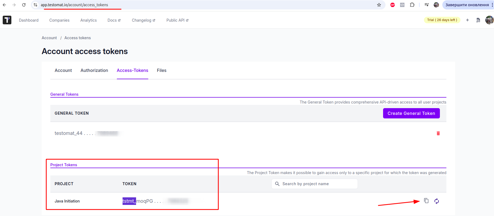
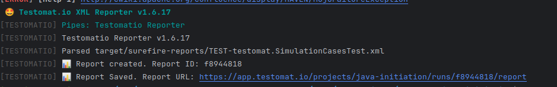
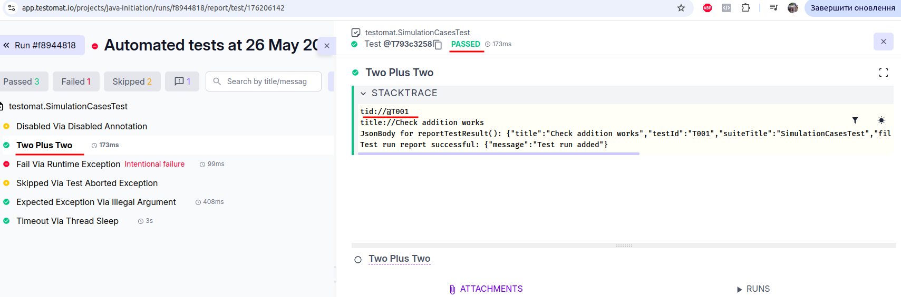

# Testomat Integration - Java Unit Tests Reporting

## Overview

This project demonstrates integration with the Testomat.io API for reporting JUnit 5 test results, using custom
annotations and API clients.

---

## Setup and Execution

### 1. Registration and API Keys

- Registered at [https://app.testomat.io/](https://app.testomat.io/)
- Obtained API keys, especially the **Project API Key**
  from [https://app.testomat.io/account/access_tokens](https://app.testomat.io/account/access_tokens).
  > **Important:** The project API key typically starts with `tstmt_` and is required for communication with the
  Testomat Reporter API.
  
  


### 2. API References Used

- [Testomat API Gist](https://gist.github.com/DavertMik/31b776be62d6a0f99f1d95488b8ac2bd)
- [Testomat Reporter API Documentation](https://github.com/testomatio/reporter/blob/master/docs/api.md)
- [Testomat API v1.0 Docs](https://app.testomat.io/docs/api/1.0.html)
- [JUnit Integration Docs](https://docs.testomat.io/project/runs/reporter/junit/)

### 3. API Interaction

- Made requests according to docs, e.g., POST `/api/login` using API key to receive a JWT token.
- Switched to using BASE_URL = `https://app.testomat.io/api/reporter` for reporting.
- Confirmed that for this endpoint, only the **project token** (starting with `tstmt_`) is valid.

### 4. Code Structure

- Created custom annotations:
    - `@TestId` for unique test identification
    - `@Title` for descriptive test names
- Implemented three main components:
    - `TestomatExtension` — handles test lifecycle and delegates reporting to API client
    - `TestomatApiClient` — executes HTTP requests to manage test runs
    - `TestResultParser` — parses and serializes JSON using Jackson

- Added `@ExtendWith(TestomatExtension.class)` to test classes for automatic reporting.
- Annotated tests with unique `@TestId` and descriptive `@Title`.

### 5. Dependencies

- Added all required dependencies to `pom.xml` based on public sources.

### 6. Environment Setup

- API keys are passed via environment variables (`TESTOMATIO`), avoiding hardcoded secrets in the code.

### 7. Test Reporting Integration

- Installed Testomat reporter package in the project:
  ```bash
  npm install @testomatio/reporter --save-dev

### 8. Created a script named`./run-tests.sh`, which runs the tests in the project and generates a test execution report in XML format:

    ```bash
    #!/bin/bash
    mvn clean test
    npx report-xml "target/surefire-reports/*.xml"

### 9. After executing this script with the command ./run-tests.sh, the terminal displayed the test results, as well as:

    [TESTOMATIO] 📊 Report created. Report ID: f8944818
    [TESTOMATIO] 📊 Report Saved. Report URL: https://app.testomat.io/projects/java-initiation/runs/f8944818/report

- Followed the link and verified the presence of the expected values generated by my services, including the custom annotations for each test (except edge cases).


*


### 10. After writing all necessary comments and JavaDocs, I completed this test assignment.

# Testomat.io Integration Sample

## How to Use

### 1. Register in Testomat.io and Get API Keys

- Go to https://app.testomat.io/
- Sign up and log in
- Navigate to **Account > Access Tokens**
- Create and copy your **Project API Key** (typically starts with `tstmt_`)

### 2. Set the API Key as Environment Variable

You can set the API key in your terminal or IDE run configuration.

**In terminal (Linux/macOS):**

```bash
export TESTOMATIO="tstmt_your_project_api_key_here"
```

**In Windows PowerShell:**

```powershell
$env:TESTOMATIO="tstmt_your_project_api_key_here"
```

Alternatively, add it to your IDE's environment variables for your run/debug configuration.

### 3. Integrate Testomat Reporter in Your Project

Install the Testomat reporter npm package as a development dependency:

```bash
npm install @testomatio/reporter --save-dev
```

### 4. Create Test Execution Script

Create a script file named `run-tests.sh` in your project root with the following content:

```bash
#!/bin/bash
mvn clean test
npx report-xml "target/surefire-reports/*.xml"
```

Make it executable:

```bash
chmod +x run-tests.sh
```

### 5. Run the Script and Verify Results

Run your tests and generate the report by executing:

```bash
./run-tests.sh
```

Check your terminal output for logs like:

```
[TESTOMATIO] 📊 Report created. Report ID: <report_id>
[TESTOMATIO] 📊 Report Saved. Report URL: https://app.testomat.io/projects/<project_name>/runs/<report_id>/report
```

Open the provided URL in your browser to verify test results and metadata in the Testomat dashboard.


